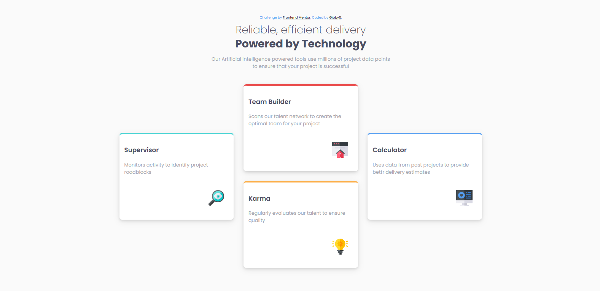

# Frontend Mentor - Four card feature section solution

This is a solution to the [Four card feature section challenge on Frontend Mentor](https://www.frontendmentor.io/challenges/four-card-feature-section-weK1eFYK). Frontend Mentor challenges help you improve your coding skills by building realistic projects. 

## Table of contents

- [Overview](#overview)
  - [The challenge](#the-challenge)
  - [Screenshot](#screenshot)
  - [Links](#links)
  - [Built with](#built-with)
  - [Continued development](#continued-development)
  - [Author](#author)

## Overview
This project is a solution to the Four card feature section on Frontend Mentor.

### The challenge

Users should be able to:

- View the optimal layout for the site depending on their device's screen size

### Screenshot

### Links

- Solution URL: [Add solution URL here](https://your-solution-url.com)
- Live Site URL: (https://gibby0.github.io/four-card-feature-section-using-html-and-css/four_card.html)

### Built with

- Semantic HTML5 markup
- CSS custom properties
-Flexbox
-Google Fonts - specifically the Inter, enhancing the stylistic delivery of the component.

### Continued development

I plan to continue focusing on improving my CSS skills, particularly in areas like responsive design and CSS grid layouts.
I plan to continue learning more about Flexbox in order to fully utilize it within my projects.

## Author
- Website - Github(https://github.com/Gibby0)
- Frontend Mentor - [@Gibby0](https://www.frontendmentor.io/profile/Gibby0)
